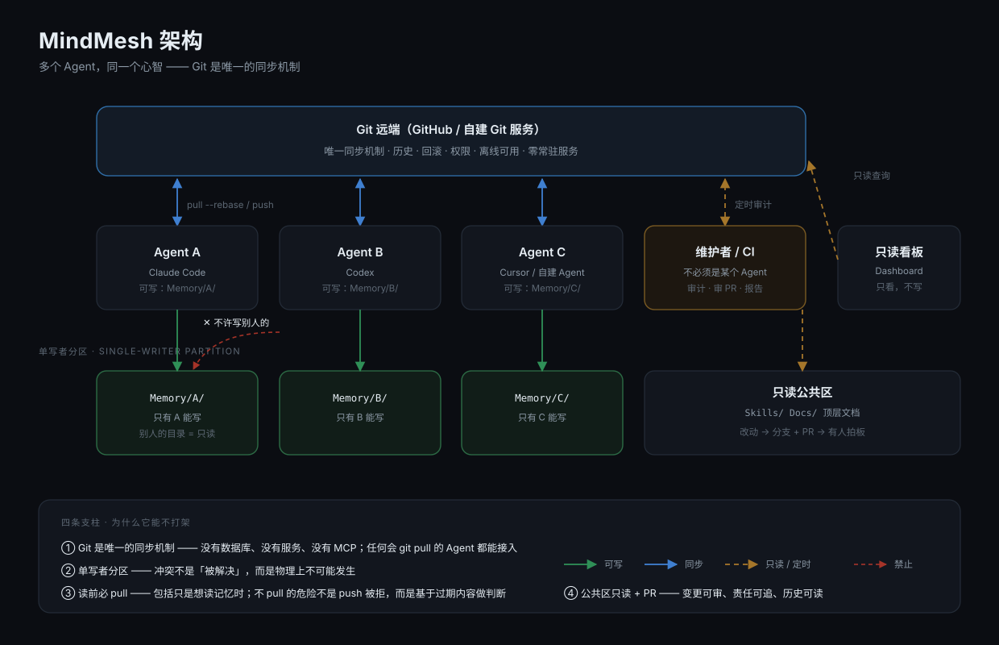

# MindMesh

< [English](./README.md) | 简体中文 >

> **多个 Agent，同一个心智。**

[](./LICENSE)
[](./VISION.md)
[](./Docs/ZeroServer.md)
[](./AGENTS.md)
[](./LABELS.md)

MindMesh 是一个 **Git 仓库**——里面装着你的 AI 搭档的**记忆**、**技能**和**协作协议**。

任何 Agent（Claude Code / Codex / Cursor / Copilot / Gemini CLI / 自建 Agent……）拿到这个仓库之后，
都能获得**大致相同的能力、记忆和行为**——哪怕它们的厂商不同、模型不同、价格不同。

> 这不是一个插件，不是一个服务，也不是一个一键安装包。
> **它是一个方案、一套思路、一种架构。**请按你的实际情况改造它。



---

## 目录

- [为什么需要它](#为什么需要它)
- [它给你什么](#它给你什么)
- [15 分钟跑通（零服务器）](#15-分钟跑通零服务器)
- [仓库结构](#仓库结构)
- [三种形态](#三种形态)
- [让 Agent 自己来](#让-agent-自己来)
- [关于「统领者」](#关于统领者)
- [看板](#看板)
- [边界与免责](#边界与免责)
- [许可](#许可)

---

## 为什么需要它

现实是：**你不太可能只用一个 Agent。**

厂商限制、订阅价格、模型擅长的方向、某个功能只在某家有、免费额度用完了……
于是你同时开着三四个 Agent，各干各的。

然后你会撞上三堵墙：

| 失败场景 | 症状 |
|---|---|
| 🧠 **失忆** | 换一个 Agent，它不知道你是谁、你机器上装了什么、上次那个坑是怎么填的 |
| ⚔️ **并行冲突** | 多个 Agent 同时改同一份「记忆」，互相覆盖，没人知道哪一份是真的 |
| 🦠 **上下文污染** | 上一个项目的规则、密钥、习惯，泄漏到了下一个项目里 |

MindMesh 用一个很朴素的办法同时解决这三件事：

> **把上下文放进一个 Git 仓库；给每个 Agent 划一块只属于自己的记忆区；剩下的全部只读。**

这句话展开就是整套架构（见 `Docs/Architecture.md`）：

1. **Git 是唯一的同步机制。** 没有数据库、没有 API、没有 MCP、没有守护进程。
   只要那个 Agent 会 `git pull`，它就能接入。**所有 Agent 都已经会了。**
2. **单写者分区（Single-Writer Partition）。** `Memory/<AgentName>/` 里只有它自己能写。
   冲突在物理上就不可能发生——这是整套设计里最关键的一条。
3. **读前必 pull。** 任何操作的第一步都是 `git pull --rebase`，**包括你只是想去读记忆**。
   不 pull 的后果不是 push 失败，而是**你基于过期记忆做了判断**——后者危险得多。
4. **协作文档即代码。** `Skills/` 和顶层文档走 PR，谁改的、为什么改，全部在 Git 历史里。

---

## 它给你什么

| 能力 | 位置 | 说明 |
|---|---|---|
| 🧠 **统一记忆** | `Memory/<Agent>/` | 每个 Agent 私有目录，但都在同一个仓库里：可检索、可回溯、可回滚 |
| 🧰 **统一技能** | `Skills/<Name>/SKILL.md` | 写一次，所有 Agent 都会用；新增/修改走 PR |
| ⚖️ **统一行为** | `AGENTS.md`（仓库根） | 协作宪法：谁是谁、能写哪里、怎么提交、什么禁止 |
| 🧭 **按需加载** | `Index.md` / `SkillsList.md` | 关键词路由，避免把整个仓库塞进上下文 |
| 🩺 **可自检** | `Scripts/audit.sh` | 扫密钥泄漏、命名违规、仓库体积、各 Agent 活跃度 |
| 📊 **可观测** | `Dashboard/` | 只读看板，把提交与记忆改动可视化 |
| 🤝 **可自助** | `Prompts/` | 直接丢给 Agent 的提示词：上线、部署、写技能、当统领 |

---

## 15 分钟跑通（零服务器）

你只需要**一个 Git 远端**。**GitHub 就够了**——不需要服务器、不需要域名、不需要 Docker。

### 1. 建仓库

把本仓库 fork 或作为模板复制到你自己的账号下（建议 **private**，之后可以随时公开）。
仓库名随意，比如 `my-mindmesh`。

### 2. 克隆

```bash
git clone git@github.com:<you>/<your-mindmesh>.git
cd <your-mindmesh>
```

### 3. 给每个 Agent 一个名字

名字 = 记忆目录名 = commit 署名 = `Agent:` trailer，**三者一字不差**。

```bash
mkdir -p Memory/ClaudeCode Memory/Codex
touch Memory/ClaudeCode/.gitkeep Memory/Codex/.gitkeep
```

### 4. 把入口丢给你的 Agent

在 Agent 的工作目录里，让它读仓库根的 `AGENTS.md` 与 `00StartHere.md`。
或者更省事：直接把 `Prompts/Bootstrap.md` 里的提示词贴给它。

### 5. 让它工作、提交、推送

```bash
git add -A Memory/ClaudeCode && git commit -m "ClaudeCode: 记录今天的进度

Agent: ClaudeCode"
git push
```

### 6. 再来一个 Agent，重复第 3～5 步

然后它们就共享同一套技能、同一套规则、同一份关于你的知识了。

> 📖 更细的部署方式（含多机、多用户、私有远程、自建 Git 服务）见 `Docs/Deployment.md`。
> 📖 **完全没有服务器**？见 `Docs/ZeroServer.md`——用 GitHub 当远端，用 GitHub 页面当前端。

---

## 仓库结构

```text
MindMesh/
├── README.md              给「人」看的门面（English）
├── README.zh.md           给「人」看的门面（简体中文）
├── AGENTS.md              ⭐ 协作协议 / 仓库宪法（唯一权威，动手前必读）
├── CLAUDE.md              协议的精简指针（Claude Code 自动加载）
├── SKILL.md               本仓库作为「一个大 Skill」的入口
├── 00StartHere.md         新 Agent 上手 8 步
├── Index.md               关键词路由表（别全读，按需加载）
├── SkillsList.md          技能总清单
├── 01Environment.md       本机环境（模板，自行填写）
├── 02Identity.md          人格与语气（模板，自行填写）
├── 03Capabilities.md      能力总表
├── 04RemoteAccess.md      远端 / SSH / 服务器访问
├── 05Secrets.example.md   凭据字段清单（只有字段，没有值）
├── 06World.md             你的世界：设备 / 网络 / 人（模板）
├── Docs/                  为什么、架构、部署、技能设计、统领者、看板
├── Prompts/               直接丢给 Agent 的提示词
├── Skills/                技能库（写一次，所有 Agent 共用）
├── Memory/                各 Agent 的私有记忆（单写者分区）
├── Scripts/               治理脚本：审计 / 泄漏扫描 / 通知 / 同步
├── Dashboard/             只读活动看板（可自托管）
├── Credentials/           🚫 已 gitignore，永不入库
└── .gitignore
```

**命名规范**：受管文件与目录一律 **PascalCase**（首字母大写、无空格、无连字符、无下划线）。
少数固定名不得修改：`AGENTS.md` `CLAUDE.md` `SKILL.md` `README.md`，以及 `YYYY-MM-DD.md` 形式的日期文件。

---

## 三种形态

不必一开始就上全套。按你实际有什么来选：

| 形态 | 你需要什么 | 你得到什么 |
|---|---|---|
| **① 单人** | 一个 GitHub 仓库 | 记忆不丢、换 Agent 不失忆 |
| **② 多 Agent** | 同一仓库 + 每 Agent 一个 token | 并行不冲突、技能统一、可追溯 |
| **③ 自建** | 一台常驻机器 / NAS / 小 VPS | 上面全部，外加看板、定时自检、私有远端 |

**绝大多数人只需要 ①。** ③ 是给已经跑到瓶颈的人的。

---

## 让 Agent 自己来

`Prompts/` 里是写给 Agent 看的提示词，不是写给人看的文档。把整段贴给它就行：

| 提示词 | 用途 |
|---|---|
| `Prompts/Bootstrap.md` | 让一个全新 Agent 读完协议并完成接入 |
| `Prompts/Deploy.md` | 让 Agent 帮你把仓库/看板/定时任务部署起来 |
| `Prompts/AuthorSkill.md` | 让 Agent 帮你**设计一个新技能**并提交 PR |
| `Prompts/Orchestrate.md` | 让某个 Agent 担任**维护者**（审计、审 PR、同步） |

设计原则很简单：**能交给 Agent 的事，就不要写进给人看的文档。**

---

## 关于「统领者」

这个仓库有一个**维护者（Orchestrator）**角色：定期审计、审技能 PR、跑泄漏扫描、同步上游。

**它不必是某个特定的 Agent。**

任何具备以下能力的 Agent 都可以担任：

- 能执行 shell 命令（跑 `Scripts/` 里的脚本）
- 能做**定时/周期任务**（cron、systemd timer、GitHub Actions、平台自带的心跳机制）
- 能操作 Git（提交、开 PR、合并）

所以它可以是 Claude Code、可以是 Codex、可以是一个自建的脚本 Agent，
甚至可以是 **GitHub Actions**——那连「Agent」都不需要了。

> ⚠️ 但请记住：**维护者是可替换的执行者，`AGENTS.md` 才是权威。**
> 如果某个 Agent 既当裁判又当运动员，请把审计与合并权限拆给另一个。

详见 `Docs/Orchestrator.md`。

---

## 看板

`Dashboard/` 是一个**只读**的静态服务 + 一个小型 Python HTTP 服务：

- 列出每个 Agent 的提交与记忆改动
- 直接浏览仓库里的 Markdown（按「公开 / 私有」前缀分级）
- 不写仓库、不改文件，**只用 Git 查询命令**读取

它默认只监听 `127.0.0.1`，**默认不带任何反向代理 / CDN / 隧道配置**。
要对外发布，请自行在你的 nginx / Caddy 上加一层——**并且先把鉴权配好**。

> 🔒 我们**刻意不提供** Cloudflare 代理、CDN、隧道之类的接入方案。
> 那是各家自己的绑定，不该混进一个中立方案里。你用什么，是你的选择。

详见 `Docs/Dashboard.md`。

---

## 边界与免责

**这是一个参考实现，不是一个产品。**

- ❌ 没有一键安装脚本（你可以让 Agent 照着 `Prompts/Deploy.md` 帮你装）
- ❌ 没有版本兼容承诺、没有 SLA、没有托管服务
- ❌ 不保证适用于你的场景——**请当作一份可抄的作业，而不是一个可运行的发行版**
- ⚠️ 仓库里**不包含任何密钥**；请务必不要把你的密钥提交进去（`Scripts/leakscan.sh` 能帮你兜底，但别依赖它）
- ⚠️ 在公开仓库里，`Memory/` 就是**公开的**。个人隐私内容请用 private 仓库，或自行拆分。

**它更像一个思维、一个方向、一个架构，而不是一个不变量。**

---

## 许可

[Apache-2.0](./LICENSE) © 2026 programmingWTF

---

> **MindMesh** —— 记忆和技能不该属于某一个 Agent。
