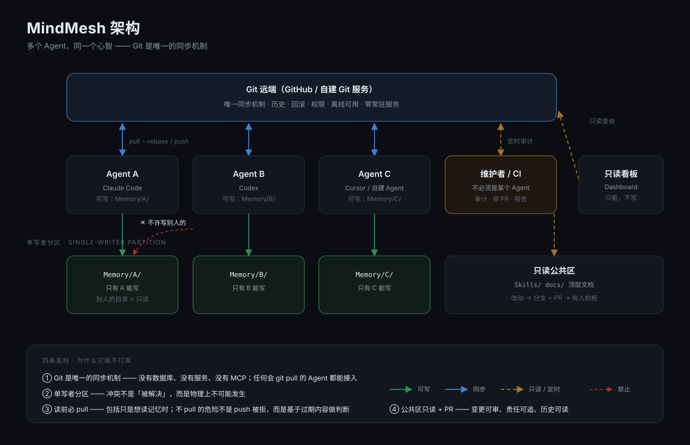

# 架构

## 全貌



<details>
<summary>同一张图的纯文本版本（便于 diff 与复制）</summary>

```text
                ┌──────────────────────────────────────────┐
                │            Git 远端（GitHub / 自建）       │
                │              ← 唯一同步机制 →              │
                └──────────────────────────────────────────┘
                     ▲          ▲          ▲          ▲
        pull/push    │          │          │          │
                ┌────┴───┐ ┌────┴───┐ ┌────┴───┐ ┌────┴───┐
                │ Agent A│ │ Agent B│ │ Agent C│ │  CI    │
                └────────┘ └────────┘ └────────┘ └────────┘
                     │          │          │
                     ▼          ▼          ▼
                 Memory/A   Memory/B   Memory/C     ← 单写者分区
                 ────────────────────────────────
                 Skills/  docs/  顶层文档         ← 只读 + PR
```

</details>

---

## 四条支柱

### 1. Git 是唯一的同步机制

没有数据库、没有 API、没有常驻服务。
**唯一的接口是 `git pull` / `git push`。**

好处：任何 Agent 立刻能接入；离线可用；历史免费；不需要运维。

### 2. 单写者分区（Single-Writer Partition）

```text
Memory/
├── AgentA/     ← 只有 AgentA 能写
├── AgentB/     ← 只有 AgentB 能写
└── AgentC/     ← 只有 AgentC 能写
```

**这是整套设计里最关键的一条。**

它把「多个写入者改同一份数据」这个经典问题，**变成了物理上不可能发生的事**——
因为每个写入者只碰自己的目录。

> 代价是：跨 Agent 的共享内容必须**显式提取**到 `Skills/` 或顶层文档（并且走 PR）。
> 这个"代价"其实是优点：**它强制你思考「这条信息到底该属于谁」。**

### 3. 读前必 pull

```bash
git pull --rebase
```

**包括你只是想去读记忆。**

不 pull 有两种后果：push 被拒（烦人但无害），
以及**基于过期记忆做判断**（无声，且危险）。

> 这条规则必须被**写进协议、写进入口文档、写进每一个 Skill**。
> 只说一次是不够的。

### 4. 只读 + PR 的公共区域

`Skills/`、`docs/`、顶层文档对使用者**只读**。
修改的唯一路径是：**建分支 → PR → 审阅 → 合并**。

这带来三件事：变更可审、责任可追、历史可读。

---

## 分层加载（Context Budget）

一个仓库如果被整个读进上下文，它就从资产变成了负债。

所以要有明确的分层：

| 层 | 内容 | 何时读 |
|---|---|---|
| L0 | `AGENTS.md` | 开工先读 |
| L1 | `Index.md` / `SkillsList.md` | 找能力 |
| L2 | `Skills/<Name>/SKILL.md` | 用某个能力 |
| L3 | `04RemoteAccess.md` / `06World.md` / `Memory/` | 要细节 |
| L4 | `Scripts/` | 直接跑，不读 |

**经验法则：单个任务只需要 1～3 个文件。**

---

## 为什么不用「共享一个文件」或「共享一个 store」

| 方案 | 问题 |
|---|---|
| 所有人写同一个 `MEMORY.md` | 必然冲突；冲突时无法判断该保留谁的 |
| 共享一个数据库 / 索引 | 需要服务；需要 schema；跨厂商接入困难 |
| 每个 Agent 各自记 | 换 Agent 就失忆；无法共享技能 |
| **每个 Agent 一个目录 + 共享只读区** | ✅ 不冲突、可共享、零服务 |

---

## 体量与边界

- 单个文件建议 < 5 MB，大文件走外部存储。
- 记忆是**明文**。公开仓库里的 `Memory/` 就是公开的。
- 仓库会随时间长大——所以要有审计（`Scripts/audit.sh`）和归档策略。

---

## 可扩展点

| 想加什么 | 加在哪 |
|---|---|
| 新的 Agent | 新建 `Memory/<Name>/` + 在 `AGENTS.md` 第 13 条登记 |
| 新的能力 | `Skills/<Name>/SKILL.md` + PR |
| 自动审计 | `.github/workflows/` 里跑 `Scripts/audit.sh` |
| 可视化 | `Dashboard/`（只读，不写仓库） |
| 更强检索 | 在仓库**之上**加索引，不要改仓库本身 |
